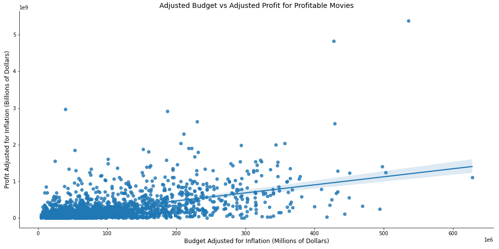
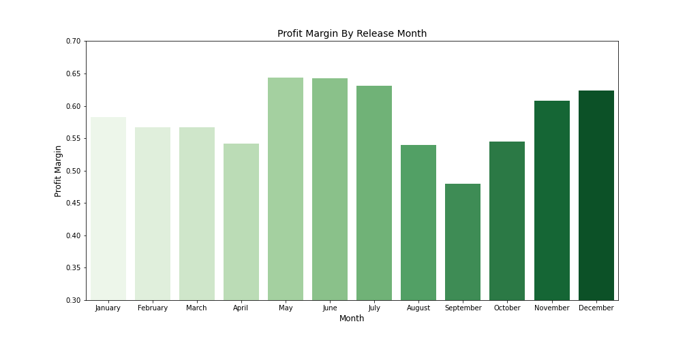

# Making Movies at Microsoft

#### Contributing Members:Amos Kibet

### Project Overview

Microsoft has stated their desire to enter the film business. They will establish a studio, but they are unfamiliar with the film business. Our goal is to collect, clean, and analyze movie data from various sources in order to make recommendations to Microsoft that will help them succeed in the movie business.

### Data and Exploration

Data was provided for use and our group chose to use one of those datasets in conjunction with data that was retrieved via webscraping.
The provided data set that was used in this project can be found at:

[/zippedData/bom.movie_gross.csv](https://github.com/AmosMaru/dsc-phase-1-project/tree/master/zippedData)

The web-scraped data used in this project was collected from the following sources:

1. https://www.the-numbers.com/movie/budgets/all/1
2. https://www.imdb.com/search/title/?title_type=feature&num_votes=5000,&languages=en&sort=boxoffice_gross_us,desc&start=1&explore=genres&ref_=adv_nx

In our analysis we explore and answer the following questions:

1. What movies are the most profitable, and how much money should you spend?
2. What genres of movies are most frequently made, and does more production translate into more profits?
3. What is the best time of the year to release a movie?
4. How do runtime and movie rating affect net profit, profit margin, and IMDb rating, if at all there is any?

## Question 1: What are the most profitable movies and how much should you spend?

To answer this question and provide a recommendation we'll make use of a budgets dataframe called `imdb_budgets_df`. Our analysis will require that we use the data to calculate profit and profit margin.

```
imdb_budgets_df['Profit'] = imdb_budgets_df['Worldwide Gross'] - imdb_budgets_df['Production Budget']

imdb_budgets_df['Profit_Margin'] = (imdb_budgets_df['Worldwide Gross'] -
                                    imdb_budgets_df['Production Budget'])/imdb_budgets_df['Worldwide Gross']
```

We will also create two columns called `Adjusted_Budget` and `Adjusted_Profit` where we recalculate a movie's budget and profit to account for inflation and allow us to perform analysis based on the value of the 2020 dollar.

We examine the overall trend of budget versus profit to see if there's any correlation.



We also take a look at the top 25 movies in terms of profit to understand their financial success and how closely we should attempt to emulate their budget. We can see in the graph below there are a few outliers so the median will end up being more useful in determining our final budget.


**Question 1 Conclusion**: We recommend that Microsoft should budget approximately $47,000,000 to make a movie. This should correlate with a profit margin above 82%.

## Question 2: Which movie genres are most commonly produced and does quantity equate to higher net profits?

We first count the number of movies in each genre and plot those results on a bar graph.

```
m_by_genre = genre_budgets_df.groupby('Genre', as_index=False)['Movie'].count().sort_values(by='Movie', ascending=False)
```

Using the same `groupby` method, we select the median net profit and profit margin for each genre. We use the median in this case as the mean is likely skewed by outliers. Outliers could either be movies with enormous profits or movies having negative profit.


Lastly, we look at the percent of net profit by genre. This informs us as to how Microsoft should allocate their movie budget to various films.

**Question 2 Conclusion**: We recommend that Microsoft should focus their efforts on the top 6 most profitable movie genres: Adventure, Action, Comedy, Drama, Sci-Fi and Animation. A further recommendation to focus on Sci-Fi and Animation due to less competition and a higher opportunity to profit.

## Question 3: What is the best time of the year to release a movie?

We start by converting the dates from the `imdb_budgets_df` dataframe to a datetime object. We then do a count by month to see the number of movies released in each month.

When grouping by month, we can select the `Net Profit` and `Profit Margin` columns so that we can see which months have the most financial success.



Finally we plot the net profit by month for a small selection of genres. We can see that there is a general trend amongst these genres for the profit in each month.


**Question 3 Conclusion:** We recommend that Microsoft release the bulk of their movies, especially Animation, during the summer months (i.e. May-July). Adventure, Drama and Comedy movies would see similar success if released in November, but the recommendation remains to focus on summer.

## Question 4: What impact, if any, does runtime and movie rating have on Net Profit, Profit Margin and IMDb rating?

To answer this question we will only focus on the 4 ratings: G, PG, PG-13, and R. We then count the ratings to see how many movies fall within each category. From there we can examine the net profit and profit margin of genre to see which has the most financial success.

It's also important to see the net profits of each rating by genre. We first do a `groupby` on rating and genre and then create a pivot table so that we can see the net profits of each rating in each genre. This will guide us as to what ratings should be targeted based on the genre of the movie being made.


**Question 4 Conclusion**: We recommend that Microsoft take into consideration the rating of the movie based on the genre and target audience. If making animation movies, it is wise to stick to a G or PG rating, otherwise PG-13 is the sweetspot. In terms of runtime, there is little correlation in terms of overall profitability.
